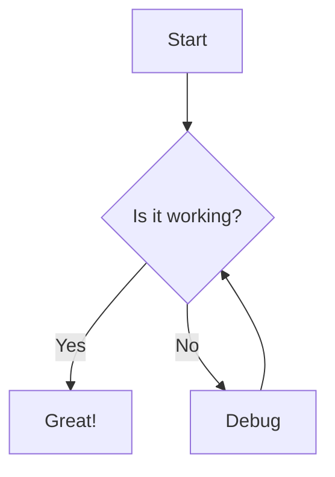

# Hello, World — Welcome to My Blog

Welcome! This is the first post on my new personal blog. I'll be sharing thoughts, experiences, and deep dives into topics I'm passionate about.

## What to Expect

This blog will cover:

- **Frontend Engineering**: React, Next.js, TypeScript, and modern web architecture
- **Creative Coding**: Three.js, WebGL shaders, and immersive web experiences
- **AI & Development**: Practical insights on AI-powered workflows
- **Performance**: Optimization techniques for production applications
- **Architecture**: System design patterns and best practices

## Tech Stack

This blog is built with:

```typescript
import { defineConfig } from 'vitepress'

export default defineConfig({
  title: 'Zhouzi Blog',
  description: 'Thoughts on frontend engineering and creative coding.',
})
```

Powered by [VitePress](https://vitepress.dev), a Vue-powered static site generator.

## Code Highlighting

```tsx
function Greeting({ name }: { name: string }) {
  return <h1>Hello, {name}!</h1>
}
```

```python
def fibonacci(n: int) -> int:
    if n <= 1:
        return n
    return fibonacci(n - 1) + fibonacci(n - 2)
```

## Math Support

$$
E = mc^2
$$

$$
\int_{-\infty}^{\infty} e^{-x^2} \, dx = \sqrt{\pi}
$$

## Mermaid Diagrams



Stay tuned for more content coming soon!
